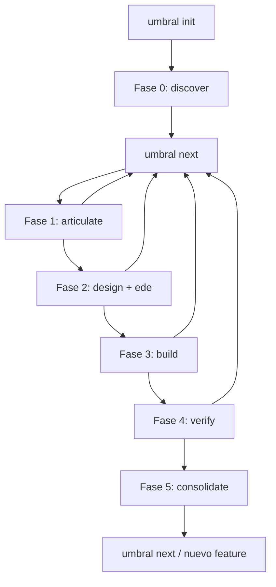

# Umbral CLI

**Framework de desarrollo con comprensión sostenible.**

Umbral es un CLI en Python que orquesta contexto para agentes de IA (por ejemplo [Claude Code](https://github.com/anthropics/claude-code) o [Cursor](https://cursor.com)). **No genera código por ti**: construye y deposita prompts contextualizados donde tu agente los lea, y valida los artefactos (notas, specs, EDEs, checkpoints) con reglas estructurales y, opcionalmente, un juez LLM.

Repositorio oficial: [https://github.com/LooperAI-Tech/umbral-cli](https://github.com/LooperAI-Tech/umbral-cli)

---

## Qué problema resuelve

Sin Umbral, el usuario debe adivinar qué documentar, en qué orden, y si “ya alcanzó” para pasar a la siguiente fase. Umbral:

1. Mantiene el estado del proyecto (fase, rol, EDEs, perfil cognitivo).
2. Inyecta metodología (preguntas socráticas, scaffolding por dominio, límites de commits, etc.) en los prompts.
3. Valida en **dos capas**: primero estructura y archivos en disco; después, si el modo del juez lo permite, semántica vía API.
4. Guía el siguiente paso con `umbral next` y ofrece visibilidad con `umbral status` y `umbral metrics`.

---

## Arquitectura (vista rápida)

- **CLI (Typer):** comandos y flags.
- **Orquestación:** Jinja2 + templates en `src/umbral/prompts/`; los adapters escriben en `.claude/commands/` o `.cursor/rules/`.
- **Validación (capa 1):** reglas por fase en disco (falta de archivos, secciones, EDEs aprobadas, etc.).
- **Juez (capa 2):** rúbricas + proveedor (Anthropic, Gemini, OpenRouter) según `.umbral/umbral.yaml`.
- **Almacenamiento:** `.umbral/umbral.yaml`, `profile.yaml`, `edes/`, `phases/`, `telemetry.yaml` (telemetría del juez y señales futuras).

Más detalle en `docs/methodology.md` y en `Umbral_plan_tecnico_desarrollo_v2.1.md` del repositorio.

---

## Requisitos

- **Python 3.11+**
- **[uv](https://docs.astral.sh/uv/)** o **[pipx](https://pypa.github.io/pipx/)** para instalar el CLI de forma aislada (recomendado en máquina de usuario final)
- **[uv](https://docs.astral.sh/uv/)** también para desarrollar clonando el repo (`uv sync`)
- Claves de API **solo si** usas el juez en modo `online` (p. ej. `ANTHROPIC_API_KEY`); en `offline` no hacen falta

---

## Instalación del paquete

En `pyproject.toml` el **nombre instalable** es `umbral-cli`; el **comando** que queda en el `PATH` es `umbral` (no hace falta que coincidan, igual que en [Spec Kit](https://github.com/github/spec-kit) con `specify-cli` / `specify`).

> **Recomendación:** instalar **desde el repositorio** (por URL `git+https://...`), igual que hace [Spec-Kit con `uv tool install` y `git+https://github.com/github/spec-kit.git`](https://github.com/github/spec-kit). Sustituye `vX.Y.Z` por el [último tag](https://github.com/LooperAI-Tech/umbral-cli/tags) o release estable cuando exista en el remoto.

### Opción 1: instalación persistente (recomendada)

Una sola vez; luego usas `umbral` en cualquier carpeta de proyecto.

**Con [uv](https://docs.astral.sh/uv/) (equivalente a `uv tool install specify-cli --from git+...` en Spec-Kit):**

```bash
# Instalar un release estable (recomendado — reemplaza vX.Y.Z por el último tag, p. ej. v0.1.0)
uv tool install umbral-cli --from git+https://github.com/LooperAI-Tech/umbral-cli.git@vX.Y.Z

# O instalar la última versión de la rama main (puede incluir cambios aún no etiquetados)
uv tool install umbral-cli --from git+https://github.com/LooperAI-Tech/umbral-cli.git
```

**Con [pipx](https://pypa.github.io/pipx/) (también válido):**

```bash
pipx install git+https://github.com/LooperAI-Tech/umbral-cli.git@vX.Y.Z
pipx install git+https://github.com/LooperAI-Tech/umbral-cli.git
```

**Comprobar la instalación:**

```bash
umbral version
```

**Actualizar** cuando haya un tag nuevo: vuelve a ejecutar el mismo `uv tool install` / `pipx install` (uv y pipx suelen actualizar al pedir de nuevo el mismo origen) o, con pipx, `pipx upgrade umbral-cli` si el paquete instalado se llama así en tu entorno.

### Opción 2: solo para desarrollar o contribuir (clonar el repo)

```bash
git clone https://github.com/LooperAI-Tech/umbral-cli.git
cd umbral-cli
uv sync
```

Ejecutar el CLI **sin** instalarlo globalmente:

```bash
uv run umbral version
```

Instalar en modo editable desde el clon (alternativa al `git+https` de arriba):

```bash
cd umbral-cli
uv tool install .   # empaqueta y expone el comando `umbral`
```

Tests (opcional):

```bash
uv sync --all-groups
uv run pytest
```

---

## Uso: primer proyecto

Trabajas en el directorio de **tu aplicación o repo** (no hace falta que sea el de Umbral). Umbral crea un directorio **`.umbral/`** con la configuración y artefactos.

Si seguiste la **instalación persistente** (`uv tool install` / `pipx`):

```bash
cd /ruta/a/tu/proyecto
umbral init mi-proyecto
```

Si solo clonaste el repo y usas el entorno local:

```bash
cd /ruta/a/tu/proyecto
uv run --directory /ruta/donde/clonaste/umbral-cli umbral init mi-proyecto
```

- Responde los prompts (dominio, escala, rol, agente, modo del juez) o usa `--yes` para valores por defecto.
- Revisa el estado: `umbral status`.

---

## Flujo por fases (metodología)

Cada fase tiene un **comando asociado**. Al terminar trabajo sustantivo, ejecutas `umbral next`: valida (capa 1 y, si aplica, capa 2) y, si el resultado es adecuado, **avanza el número de fase** en `umbral.yaml`.

| Fase | Nombre | Comando principal | Qué aporta |
|------|--------|-------------------|------------|
| 0 | Descubrimiento | `umbral discover` | Problema validado, mapa de dominio, notas. |
| 1 | Articulación | `umbral articulate` | Spec con casos borde, fallas, alcance, datos. |
| 2 | Diseño | `umbral design --level 1\|2\|3` | EDE (Estructura de Decisión Explícita); `umbral ede` para listar, validar, aprobar. |
| 3 | Construcción | `umbral build -c <contexto>` | Prompt de andamiaje (Guía / Andamio / Desbloqueo) según el perfil. |
| 4 | Verificación | `umbral verify` | Comprehension Gate; genera `checkpoint-*.yaml`. |
| 5 | Consolidación | `umbral consolidate` | Drift EDE–código, promoción de rol, governance. |

Comandos transversales:

- `umbral next` — validación y avance de fase.
- `umbral profile show` / `umbral profile update` — perfil cognitivo.
- `umbral metrics` — dashboard de las 13 métricas (las que tengan datos en tu proyecto).
- `umbral version` — versión del CLI.

### Diagrama del flujo (simplificado)



En la práctica entrarás varias veces a `umbral next` mientras afinas archivos; la capa 1 te dice qué falta; el juez (si está online) comenta brechas semánticas.

### Validación en dos capas

1. **Determinista:** presencia y forma de `discovery-notes.md`, `spec-*.md`, EDEs aprobadas, checkpoints, etc. Sin coste de API.
2. **Juez LLM:** si `judge.mode` es `online` y la capa 1 pasa, se envía rúbrica + artefactos; el veredicto es JSON (`complete` / `incomplete` / `needs_revision`). Si no hay clave o falla la API, puedes degradar a `offline` o usar `fallback_to_offline` en `umbral.yaml`.

---

## Configuración del juez (resumen)

En `.umbral/umbral.yaml` la sección `judge` controla el modo (`online` / `offline`), el proveedor y el modelo. El CLI no guarda nunca claves en ese archivo: usa variables de entorno (p. ej. `ANTHROPIC_API_KEY`).

---

## Estructura `.umbral/` (referencia)

- `umbral.yaml` — nombre del proyecto, dominio, escala, rol, fase actual, juez.
- `profile.yaml` — conceptos de dominio, deuda de comprensión, mastery por contexto, etc.
- `edes/*.md` — EDEs con frontmatter YAML.
- `phases/*.md`, `checkpoint-*.yaml` — fases y gates.
- `telemetry.yaml` — contadores del juez (p. ej. invocaciones y fallbacks) usados por `umbral metrics`.

---

## Documentación adicional

- `docs/methodology.md` — resumen de la metodología.
- `Umbral_plan_tecnico_desarrollo_v2.1.md` — plan técnico completo.
- `CHANGELOG.md` — historial de cambios.

---

## Desarrollo (en el repositorio Umbral)

```bash
git clone https://github.com/LooperAI-Tech/umbral-cli.git
cd umbral-cli
uv sync --all-groups
uv run pytest
```

La integración continua (pytest con `uv`) está definida en `.github/workflows/ci.yml` para las ramas principales.

---

## Licencia

MIT. Ver `LICENSE`.
